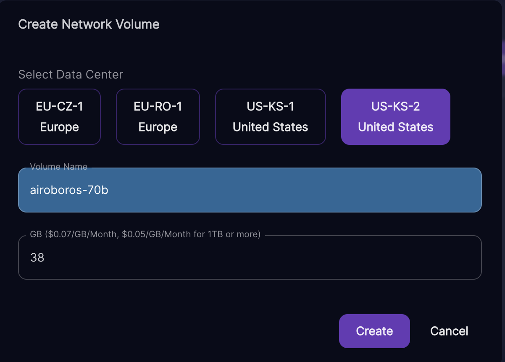
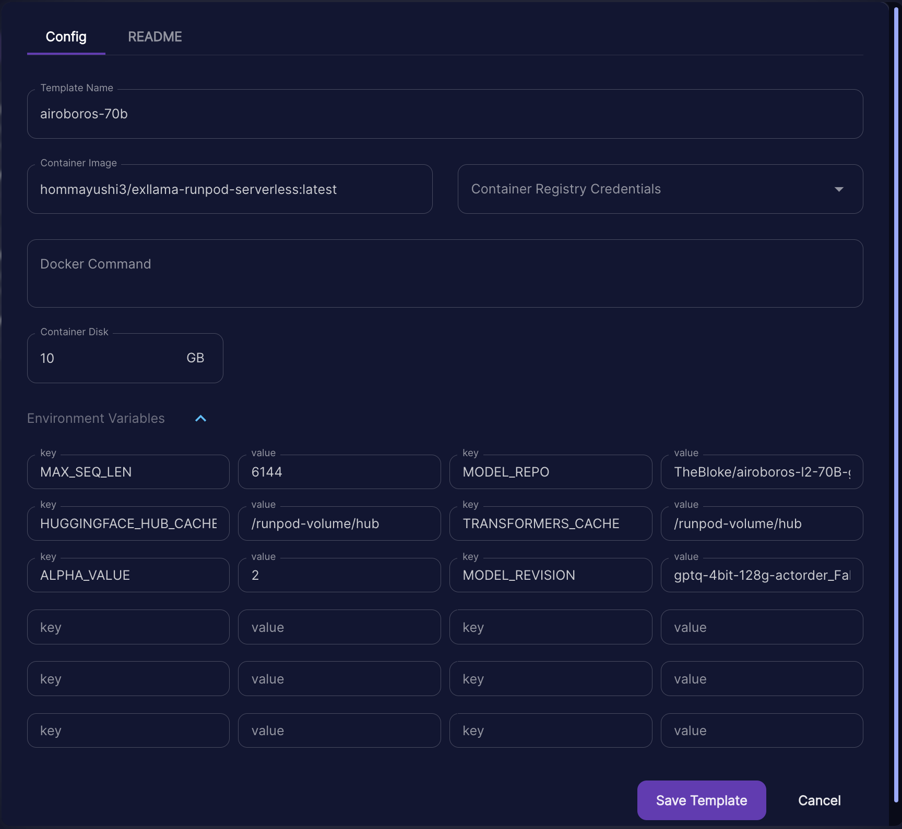

# exllama-runpod-serverless

> [LLaMA](https://ai.facebook.com/blog/large-language-model-llama-meta-ai/) [GPTQ](https://arxiv.org/abs/2210.17323) models with fast [ExLlama](https://github.com/turboderp/exllama) inference on [RunPod Serverless GPUs](https://www.runpod.io/serverless-gpu)

## Summary
This Docker image runs a Llama model on a serverless RunPod instance using the optimized [turboderp's exllama repo](https://github.com/turboderp/exllama).

## Set Up
1. Create a RunPod account and navigate to the [RunPod Serverless Console](https://www.runpod.io/console/serverless).
2. (Optional) Create a Network Volume to cache your model to speed up cold starts (but will incur some cost per hour for storage).
    - *Note: Only certain Network Volume regions are compatible with certain instance types on RunPod, so try out if your Network Volume makes your desired instance type Unavailable, try other regions for your Network Volume.*



3. Navigate to `My Templates` and click on the `New Template` button.
4. Enter in the following fields and click on the `Save Template` button:

    | Template Field | Value |
    | --- | --- |
    | Template Name | `exllama-runpod-serverless` |
    | Container Image | `hommayushi3/exllama-runpod-serverless:latest` |
    | Container Disk | A size large enough to store your libraries + your desired model in 4bit. |

    - Container Disk Size Guide:
        | Model Parameters | Storage & VRAM |
        | --- | --- |
        | 7B | 6GB |
        | 13B | 9GB |
        | 33B | 19GB |
        | 65B | 35GB |
        | 70B | 38GB |

    - Environment Variables:

        | Environment Variable | Example Value |
        | --- | --- |
        | (Required) `MODEL_REPO` | `TheBloke/airoboros-7B-gpt4-1.4-GPTQ` or any other repo for GPTQ Llama model. See https://huggingface.co/models?other=llama&sort=trending&search=thebloke+gptq for other models. Must have `.safetensors` file(s). |
        | (Optional) `PROMPT_PREFIX` | `"USER: "` |
        | (Optional) `PROMPT_SUFFIX` | `"ASSISTANT: "` |
        | (Optional) `MAX_SEQ_LEN` | `4096` |
        | (Optional) `ALPHA_VALUE` | `1` |
        | (If using Network Volumes) `HUGGINGFACE_HUB_CACHE` | `/runpod-volume/hub` |
        | (If using Network Volumes) `TRANSFORMERS_CACHE` | `/runpod-volume/hub` |



4. Now click on `My Endpoints` and click on the `New Endpoint` button.
5. Fill in the following fields and click on the `Create` button:
    | Endpoint Field | Value |
    | --- | --- |
    | Endpoint Name | `exllama-runpod-serverless` |
    | Select Template | `exllama-runpod-serverless` |
    | Min Provisioned Workers | `0` |
    | Max Workers | `1` |
    | Idle Timeout | `5` seconds |
    | FlashBoot | Checked/Enabled |
    | GPU Type(s) | Use the `Container Disk` section of step 3 to determine the smallest GPU that can load the entire 4 bit model. In our example's case, use 16 GB GPU. Make smaller if using Network Volume instead. |
    | (Optional) Network Volume | `airoboros-7b` |


## Inference Usage
See the `predict.py` file for an example. For convenience we also copy the code below.

```py
import os
import requests
from time import sleep
import logging
import argparse
import sys
import json

endpoint_id = os.environ["RUNPOD_ENDPOINT_ID"]
URI = f"https://api.runpod.ai/v2/{endpoint_id}/run"


def run(prompt, params={}, stream=False):
    request = {
        'prompt': prompt,
        'max_new_tokens': 1800,
        'temperature': 0.3,
        'top_k': 50,
        'top_p': 0.7,
        'repetition_penalty': 1.2,
        'batch_size': 8,
        'stream': stream
    }

    request.update(params)

    response = requests.post(URI, json=dict(input=request), headers = {
        "Authorization": f"Bearer {os.environ['RUNPOD_AI_API_KEY']}"
    })

    if response.status_code == 200:
        data = response.json()
        task_id = data.get('id')
        return stream_output(task_id, stream=stream)


def stream_output(task_id, stream=False):
    # try:
    url = f"https://api.runpod.ai/v2/{endpoint_id}/stream/{task_id}"
    headers = {
        "Authorization": f"Bearer {os.environ['RUNPOD_AI_API_KEY']}"
    }

    previous_output = ''

    try:
        while True:
            response = requests.get(url, headers=headers)
            if response.status_code == 200:
                data = response.json()
                if len(data['stream']) > 0:
                    new_output = data['stream'][0]['output']

                    if stream:
                        sys.stdout.write(new_output[len(previous_output):])
                        sys.stdout.flush()
                    previous_output = new_output
                
                if data.get('status') == 'COMPLETED':
                    if not stream:
                        return previous_output
                    break
                    
            elif response.status_code >= 400:
                print(response)
            # Sleep for 0.1 seconds between each request
            sleep(0.1 if stream else 1)
    except Exception as e:
        print(e)
        cancel_task(task_id)
    

def cancel_task(task_id):
    url = f"https://api.runpod.ai/v2/{endpoint_id}/cancel/{task_id}"
    headers = {
        "Authorization": f"Bearer {os.environ['RUNPOD_AI_API_KEY']}"
    }
    response = requests.get(url, headers=headers)
    return response


if __name__ == '__main__':
    parser = argparse.ArgumentParser(description='Runpod AI CLI')
    parser.add_argument('-s', '--stream', action='store_true', help='Stream output')
    parser.add_argument('-p', '--params_json', type=str, help='JSON string of generation params')

    prompt = """Given the following clinical notes, what tests, diagnoses, and recommendations should the I give? Provide your answer as a detailed report with labeled sections "Diagnostic Tests", "Possible Diagnoses", and "Patient Recommendations".

17-year-old male, has come to the student health clinic complaining of heart pounding. Mr. Cleveland's mother has given verbal consent for a history, physical examination, and treatment
-began 2-3 months ago,sudden,intermittent for 2 days(lasting 3-4 min),worsening,non-allev/aggrav
-associated with dispnea on exersion and rest,stressed out about school
-reports fe feels like his heart is jumping out of his chest
-ros:denies chest pain,dyaphoresis,wt loss,chills,fever,nausea,vomiting,pedal edeam
-pmh:non,meds :aderol (from a friend),nkda
-fh:father had MI recently,mother has thyroid dz
-sh:non-smoker,mariguana 5-6 months ago,3 beers on the weekend, basketball at school
-sh:no std,no other significant medical conditions."""
    args = parser.parse_args()
    params = json.loads(args.params_json) if args.params_json else "{}"
    import time
    start = time.time()
    print(run(prompt, params=params, stream=args.stream))
    print("Time taken: ", time.time() - start, " seconds")
```

Run the above code using the following command in terminal with the runpoint endpoint id assigned to your endpoint in step 5.
```bash
RUNPOD_AI_API_KEY='**************' RUNPOD_ENDPOINT_ID='*******' python predict.py
```
To run with streaming enabled, use the `--stream` option. To set generation parameters, use the `--params_json` option to pass a JSON string of parameters:
```bash
RUNPOD_AI_API_KEY='**************' RUNPOD_ENDPOINT_ID='*******' python predict.py --params_json '{"temperature": 0.3, "max_tokens": 1000, "prompt_prefix": "USER: ", "prompt_suffix": "ASSISTANT: "}'
```
You can generate the API key [here](https://www.runpod.io/console/serverless/user/settings) under API Keys.
